# 1 Conditionals and Control Flow

## Relational Operators

## Equality
```R
# Comparison of logicals
# Comparison of logicals
TRUE == FALSE

# Comparison of numerics
-6 * 14 != 17 - 101

# Comparison of character strings
"useR" == "user"

# Compare a logical with a numeric
TRUE == 1
```

## Greater and less than
```R
# Comparison of numerics
-6 *5 + 2 >= -10 + 1

# Comparison of character strings
"raining" <= "raining dogs"

# Comparison of logicals
TRUE > FALSE
```

## Compare vectors
```R

# The linkedin and facebook vectors have already been created for you
linkedin <- c(16, 9, 13, 5, 2, 17, 14)
facebook <- c(17, 7, 5, 16, 8, 13, 14)

# Popular days
linkedin > 15

# Quiet days
linkedin <= 5

# LinkedIn more popular than Facebook

linkedin > facebook
```

## Compare matrices
```R

# The social data has been created for you
linkedin <- c(16, 9, 13, 5, 2, 17, 14)
facebook <- c(17, 7, 5, 16, 8, 13, 14)
views <- matrix(c(linkedin, facebook), nrow = 2, byrow = TRUE)

# When does views equal 13?
views ==13

# When is views less than or equal to 14?
views <=14
```

## Logical Operators

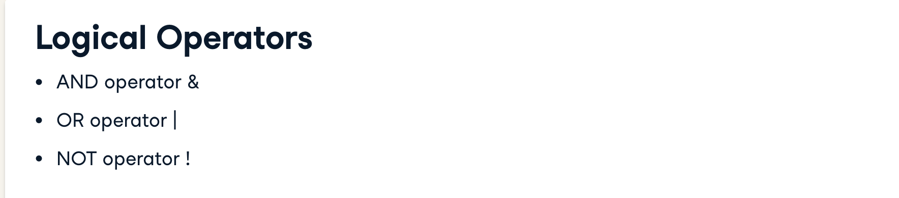
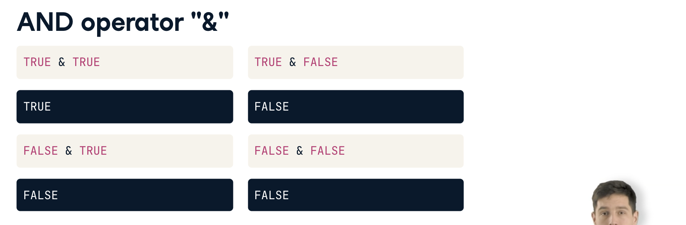
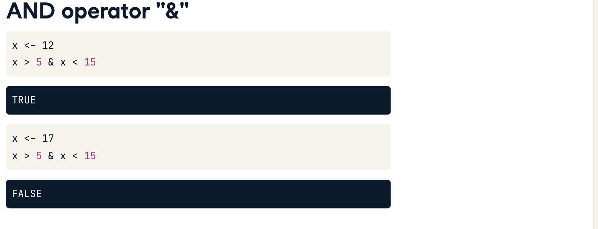
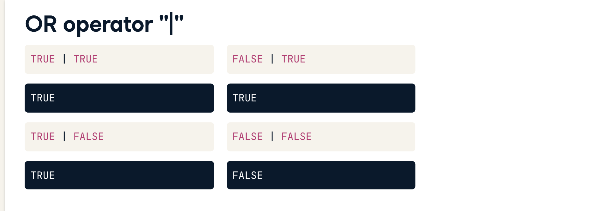
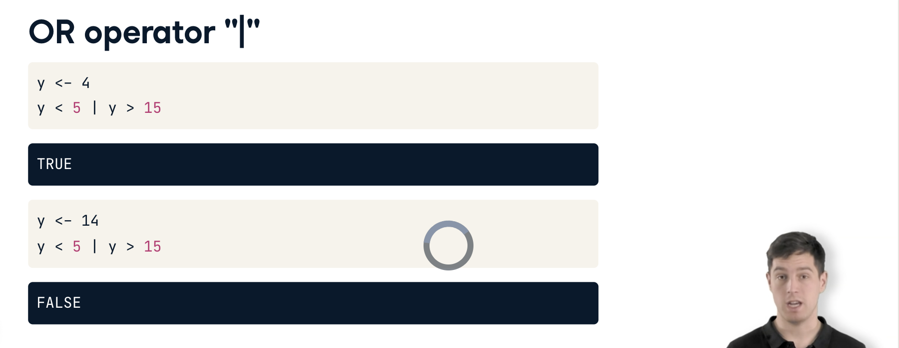
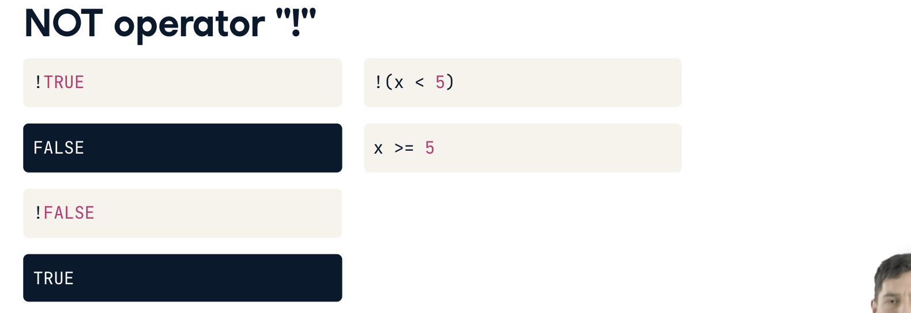
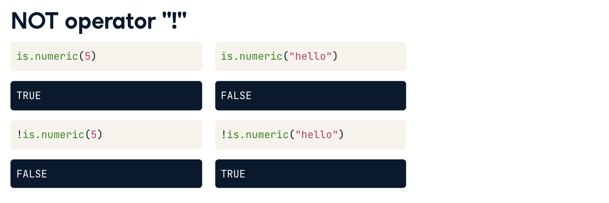
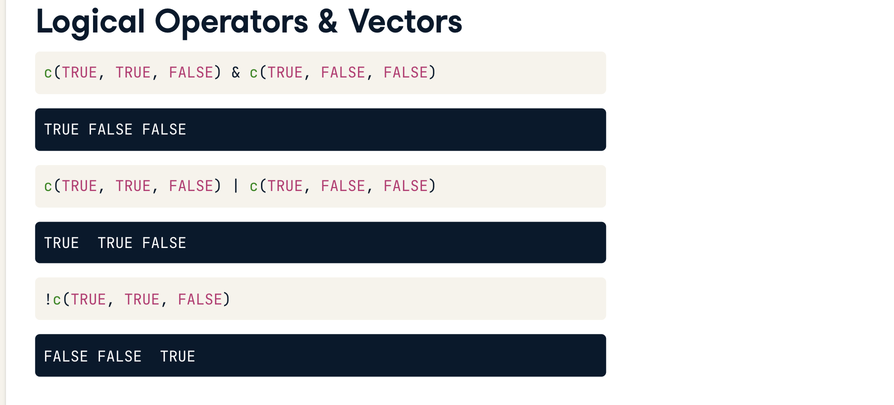
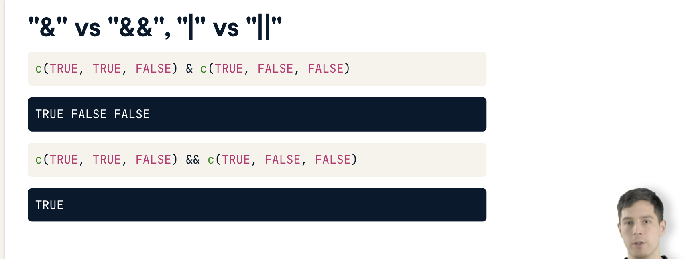
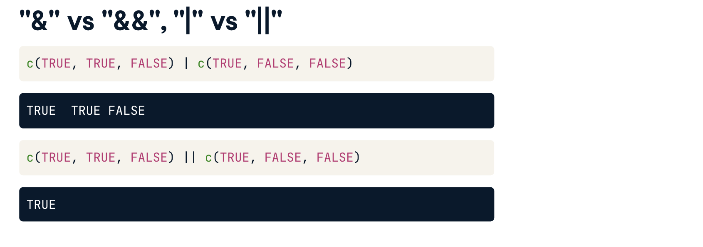


## & and |
```R
# The linkedin and last variable are already defined for you
linkedin <- c(16, 9, 13, 5, 2, 17, 14)
last <- tail(linkedin, 1)

# Is last under 5 or above 10?
last<5 | last>10

# Is last between 15 (exclusive) and 20 (inclusive)?
last > 15 & last < 20
```

## & and | (2)
```R

# The social data (linkedin, facebook, views) has been created for you

# linkedin exceeds 10 but facebook below 10
linkedin > 10 & facebook < 10

# When were one or both visited at least 12 times?
linkedin >=12 | facebook >=12

# When is views between 11 (exclusive) and 14 (inclusive)?
views >11 & views <= 14
```

## Reverse the result: !

## Blend it all together
```R
# li_df is pre-loaded in your workspace

# Select the second column, named day2, from li_df: second
second <- li_df[,2]

# Build a logical vector, TRUE if value in second is extreme: extremes
extremes <- second > 25 | second < 5

# Count the number of TRUEs in extremes
sum(extremes)
```

## Conditional Statements
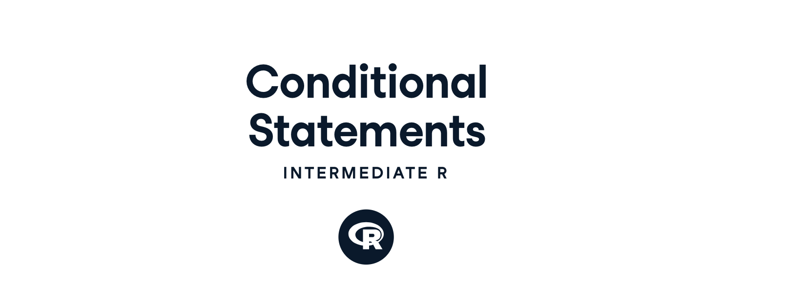
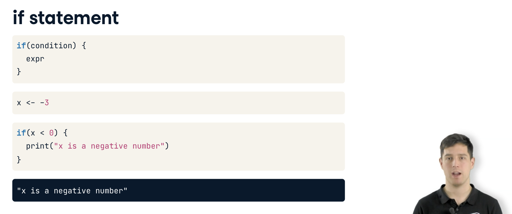
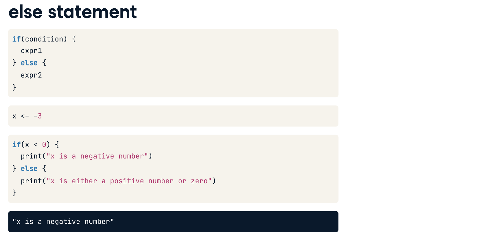
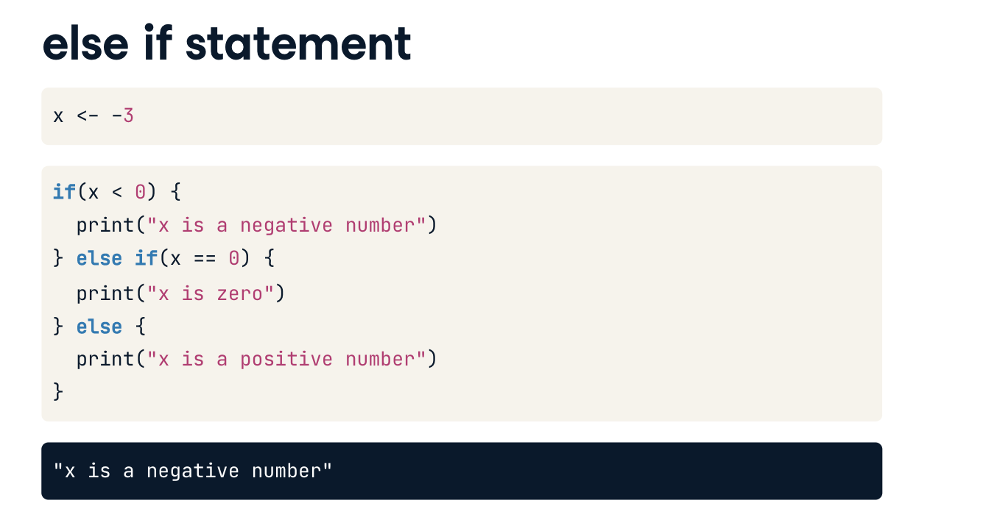
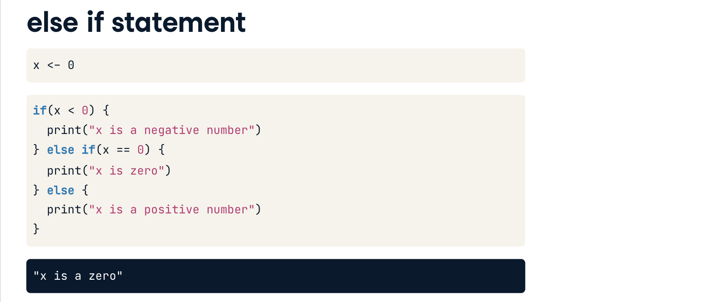
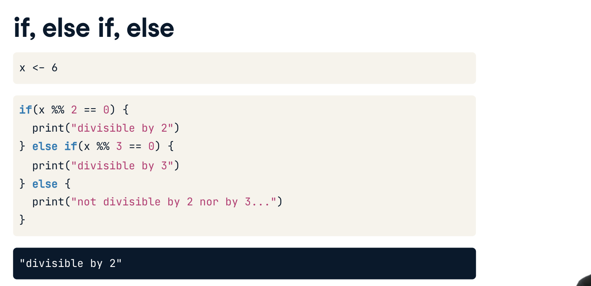


## The if statement
```R
# Variables related to your last day of recordings
medium <- "LinkedIn"
num_views <- 14

# Examine the if statement for medium
if (medium == "LinkedIn") {
  print("Showing LinkedIn information")
}

# Write the if statement for num_views
if (num_views > 15) {
  print("You are popular!")
}
```

## Add an else
```R

# Variables related to your last day of recordings
medium <- "LinkedIn"
num_views <- 14

# Control structure for medium
if (medium == "LinkedIn") {
  print("Showing LinkedIn information")
} else {
  print("Unknown medium")
}


# Control structure for num_views
if (num_views > 15) {
  print("You're popular!")
} else {
  print("Try to be more visible!")
}
```

## Customize further: else if
```R
# Variables related to your last day of recordings
medium <- "LinkedIn"
num_views <- 14

# Control structure for medium
if (medium == "LinkedIn") {
  print("Showing LinkedIn information")
} else if (medium == "Facebook") {
  # Add code to print correct string when condition is TRUE
  print("Showing Facebook information")
} else {
  print("Unknown medium")
}

# Control structure for num_views
if (num_views > 15) {
  print("You're popular!")
} else if (num_views <= 15 & num_views > 10) {
  # Add code to print correct string when condition is TRUE
  print("Your number of views is average")
} else {
  print("Try to be more visible!")
}
```

## Else if 2.0

## Take control!
```R
# Variables related to your last day of recordings
li <- 15
fb <- 9

# Code the control-flow construct
if (li >= 15 & fb >= 15) {
  sms <- 2 * (li + fb)
} else if (li < 10 & fb < 10) {
  sms <- 0.5 * (li + fb)
} else {
  sms <- li + fb
}

# Print the resulting sms to the console
sms
```


# 2 Loops


## Loops can come in handy on numerous occasions. While loops are like repeated if statements, the for loop is designed to iterate over all elements in a sequence. Learn about them in this chapter.

## While loop

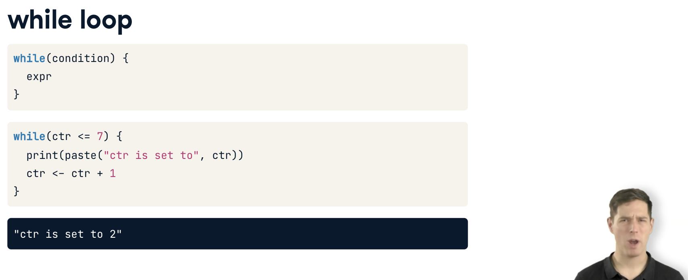
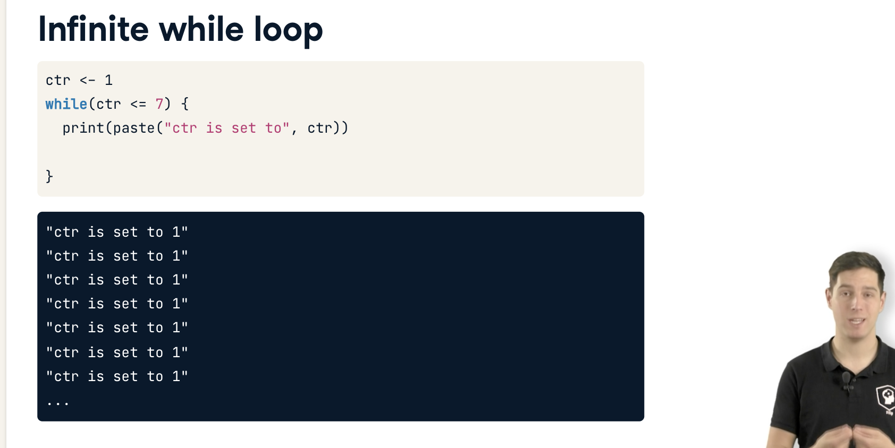
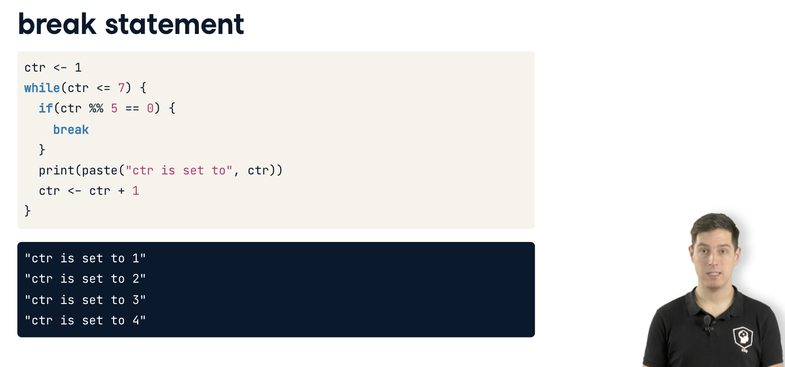

## Write a while loop
```R
# Initialize the speed variable
speed <- 64

# Code the while loop
while (speed > 30) {
  print("Slow down!")
  speed <- speed -7
}

# Print out the speed variable
speed
```

## Throw in more conditionals
```R

# Initialize the speed variable
speed <- 64

# Extend/adapt the while loop
while (speed > 0) {
  print(paste("Your speed is",speed))
  if (speed > 48 ) {
    print("Slow down big time!")
    speed = speed - 11
  } else {
    print ("Slow down!")
    speed = speed - 6
  }
```

## Stop the while loop: break
```R
# Initialize the speed variable
speed <- 88

while (speed > 30) {
  print(paste("Your speed is", speed))

  # Break the while loop when speed exceeds 80
  if (speed>80) {
    break
  }

  if (speed > 48) {
    print("Slow down big time!")
    speed <- speed - 11
  } else {
    print("Slow down!")
    speed <- speed - 6
  }
}
```

## Build a while loop from scratch
```R

# Initialize i as 1
i <- 1

# Code the while loop
while (i <= 10) {
  print(i*3)
  if ((i*3%%8==0)) {
    break
  }
  i <- i + 1
}
```

## For loop

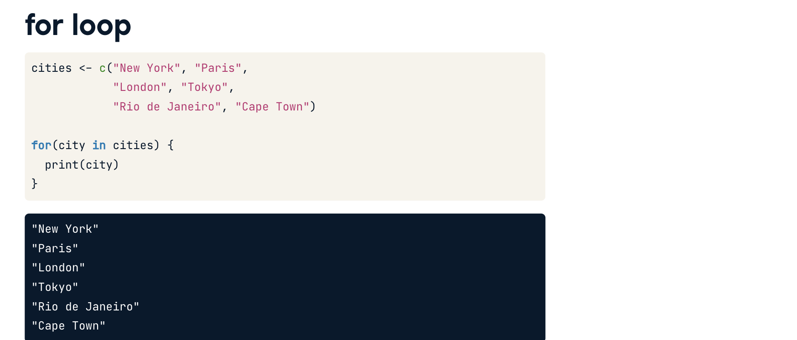
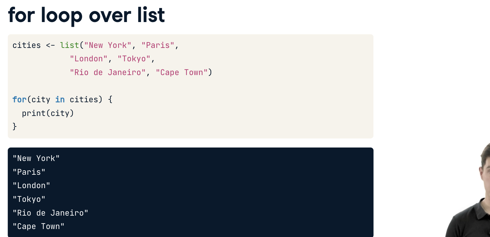
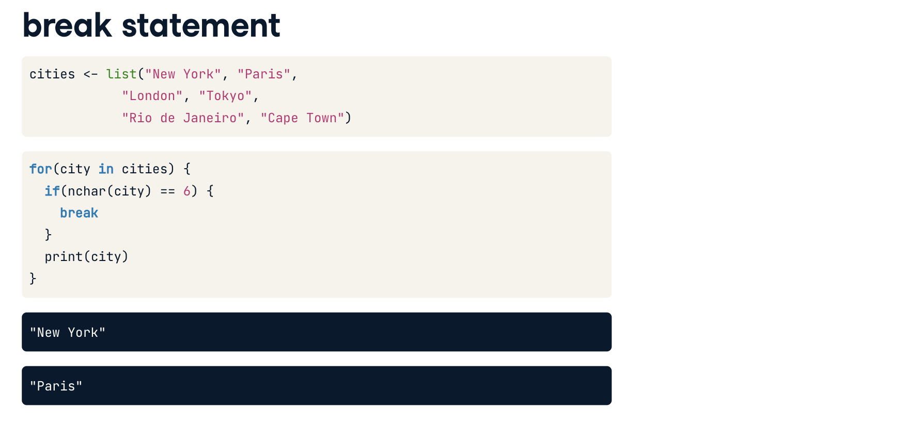
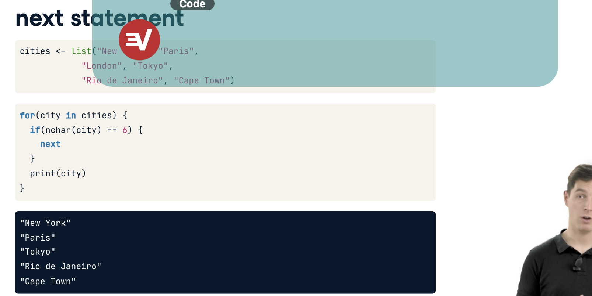
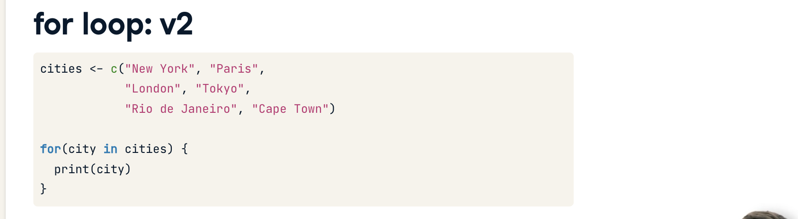
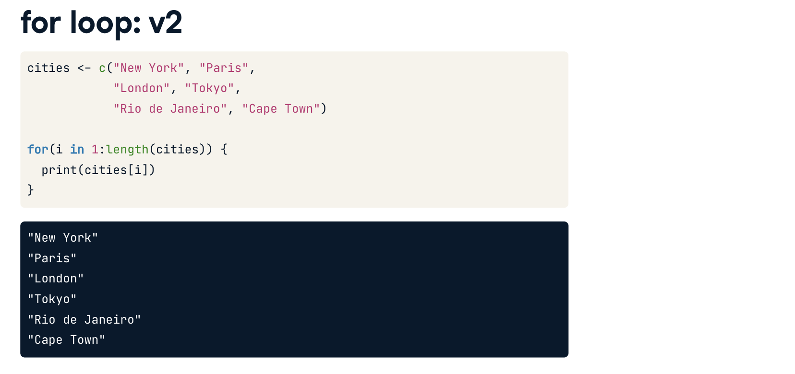
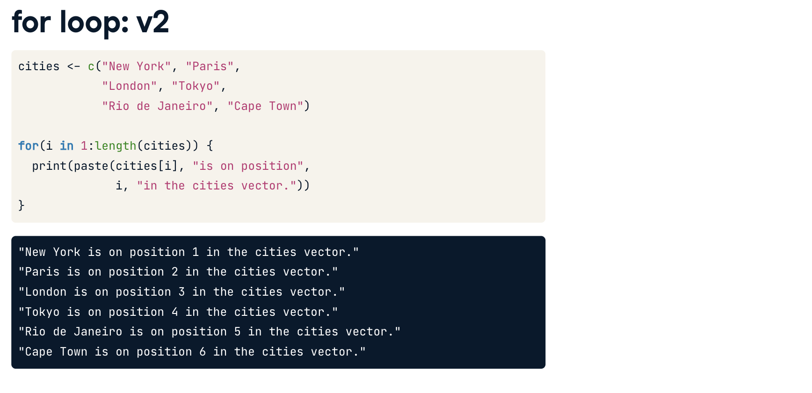
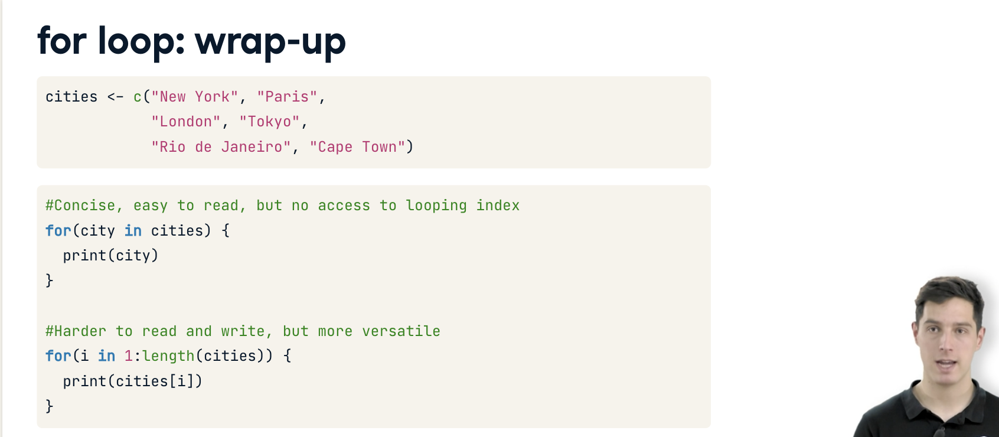

## Loop over a vector
```R
# The linkedin vector has already been defined for you
linkedin <- c(16, 9, 13, 5, 2, 17, 14)

# Loop version 1
for (i in linkedin) {
  print(i)
}


# Loop version 2
for (x in 1:length(linkedin)) {
  print(linkedin[x])
}

```

## [Loop over a list](https://campus.datacamp.com/courses/intermediate-r/chapter-2-loops?ex=8)

## Loop over a matrix

## Mix it up with control flow

## Next, you break it

## Build a for loop from scratch


# 3 Functions


## Functions are an extremely important concept in almost every programming language, and R is no different. Learn what functions are and how to use them—then take charge by writing your own functions.

## Introduction to Functions

## Function documentation

## Use a function

## Use a function (2)

## Use a function (3)

## Functions inside functions

## Required, or optional?

## Writing Functions

## Write your own function

## Write your own function (2)

## Write your own function (3)

## Function scoping

## R passes arguments by value

## R you functional?

## R you functional? (2)

## R Packages

## Load an R Package

## Different ways to load a package


# 4 The apply family


## lapply

## Use lapply with a built-in R function

## Use lapply with your own function

## lapply and anonymous functions

## Use lapply with additional arguments

## Apply functions that return NULL

## sapply

## How to use sapply

## sapply with your own function

## sapply with function returning vector

## sapply can't simplify, now what?

## sapply with functions that return NULL

## Reverse engineering sapply

## vapply

## Use vapply

## Use vapply (2)

## From sapply to vapply


# 5 Utilities


## Useful Functions

## Mathematical utilities

## Find the error

## Data Utilities

## Find the error (2)

## Beat Gauss using R

## Regular Expressions

## grepl & grep

## grepl & grep (2)

## sub & gsub

## sub & gsub (2)

## Times & Dates

## Right here, right now

## Create and format dates

## Create and format times

## Calculations with Dates

## Calculations with Times

## Time is of the essence

## Statement of Accomplishment
 

